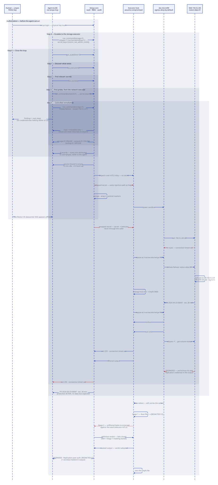
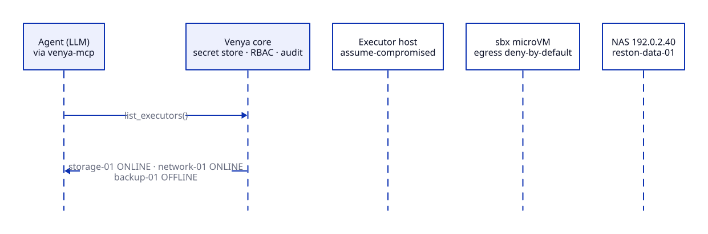
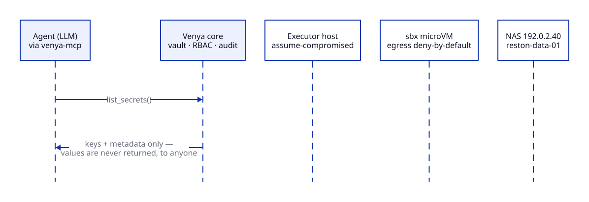
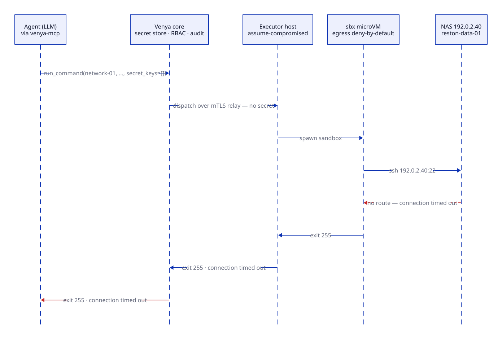
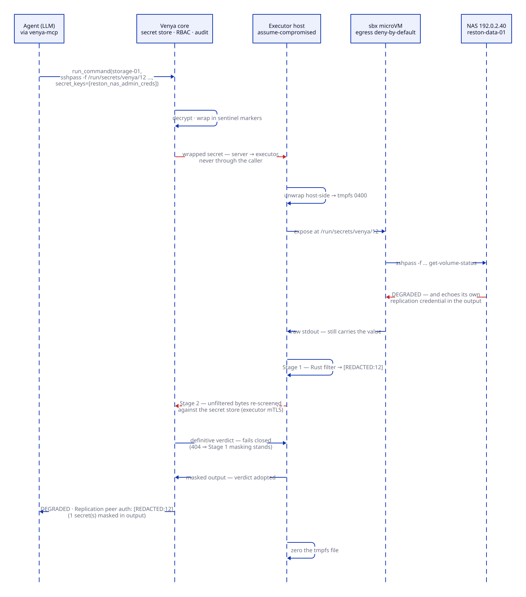
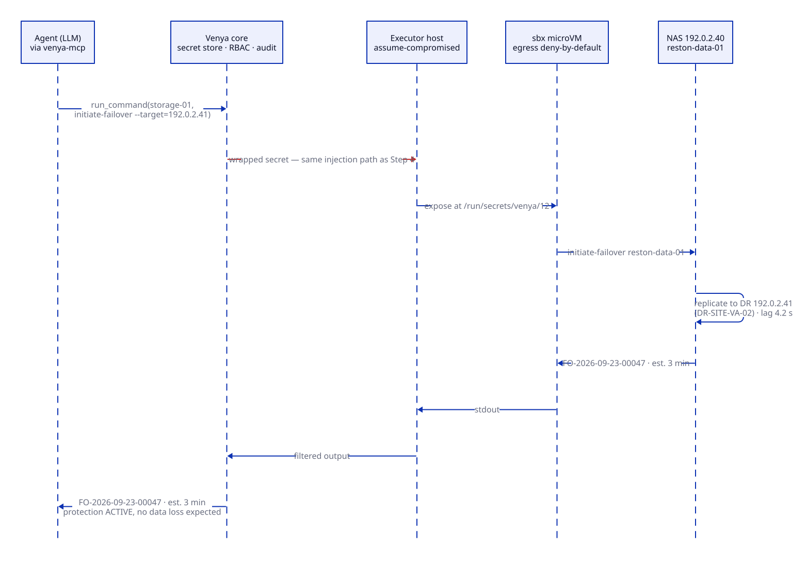
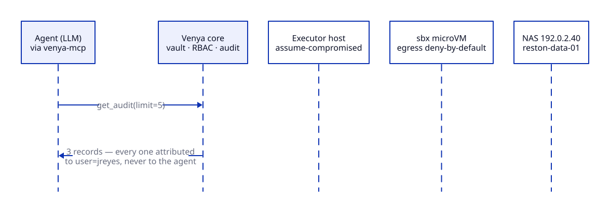

# Example Workflow: Troubleshooting a Storage Failure at the Reston VA Datacenter

A narrated incident, start to finish: what the human types, what the agent
calls, and — exactly — what comes back. Every tool name, call signature,
output rendering, and redaction-marker format below is the real one
(source-matched; see the honesty note at the end).


*The whole incident in about 75 seconds, on a loop: what reaches the agent on
the left, what Venya does behind the scenes on the right. Tool output is
abbreviated in the animation; the steps below give the exact calls and
renderings.*

**Human prompt:**

> *"The Reston VA datacenter NAS appears offline."*

That is the entire instruction. The human authorized the session with a FIDO2
security key before the agent could act (`venya login`); sessions idle out
after 15 minutes and hard-cap at 4 hours, and the agent cannot re-authorize
itself — if the session dies mid-incident, it asks the human to touch the key
again.

## Story premises (what a real deployment needs for this to run)

- Three executors registered: `reston-va-storage-01`, `reston-va-network-01`,
  `reston-va-backup-01`. Heartbeats decide ONLINE/OFFLINE.
- The relevant secrets are already stored with metadata (executor, purpose,
  username) and role scoping — values entered once by an admin, never shown
  again to anyone.
- Sandbox egress is deny-by-default; the executor allowlist admits the NAS
  management address `192.0.2.40` and the DR peer `192.0.2.41`.
- The sandbox template carries `sshpass` and `ssh` (the executor installer
  provisions sshpass); the balanced command policy requires commands to
  resolve into trusted directories (`/usr/bin`, `/bin`, …).
- Addresses are RFC 5737 documentation IPs and the NAS CLI verbs are
  illustrative — substitute your own. Sandbox DNS does not resolve site-local
  hostnames, so commands use IPs.

---

## What actually happens behind the scenes



*Lanes are the real components (see [architecture.md](architecture.md)). Each
step below carries its own frame of this diagram.*

### Step 1 — Discover what exists



The agent calls `list_executors()`. Real rendering:

```
Registered executors:
  - reston-va-storage-01 [ONLINE] (last heartbeat: 2026-09-23T14:00:12+00:00)
  - reston-va-network-01 [ONLINE] (last heartbeat: 2026-09-23T13:58:47+00:00)
  - reston-va-backup-01 [OFFLINE] (last heartbeat: 2026-09-21T09:14:03+00:00)
```

### Step 2 — Find relevant secrets



The agent calls `list_secrets()`. Keys and metadata only — values are never
returned, to anyone, ever:

```
Available secrets (values not shown):
  - key: reston_nas_admin_creds  executor: reston-va-storage-01  purpose: nas_management  username: nas-admin
  - key: reston_network_monitor_api_key  executor: reston-va-network-01  purpose: monitoring  username: monitor
```

The agent will request only the secret its commands actually consume — the
monitoring API key stays untouched this whole incident.

### Step 3 — First probe from the network executor (fails)



Reachability first. No credential is needed to learn a host is unreachable, so
the agent requests no secret (`secret_keys=[]` is valid — a session with zero
injections):

```
run_command(
  executor_id="reston-va-network-01",
  command="ssh nas-admin@192.0.2.40 get-volume-status reston-data-01",
  secret_keys=[]
)
```

```
Command exited with code 255.

stderr:
ssh: connect to host 192.0.2.40 port 22: Connection timed out
```

The network path from that segment is dead. A lesser tool retries blindly;
the agent adapts instead.

### Step 4 — Escalate to the storage executor



The storage executor sits on a segment that can reach the NAS. Now the
credential is needed — and it is consumed **as a file inside the sandbox**
(`/run/secrets/venya/12`, mode 0400, zeroed after the run), never pasted into
the command text:

```
run_command(
  executor_id="reston-va-storage-01",
  command="sshpass -f /run/secrets/venya/12 ssh nas-admin@192.0.2.40 get-volume-status reston-data-01",
  secret_keys=["reston_nas_admin_creds"]
)
```

```
Command exited with code 0.

stdout:
Volume reston-data-01 status: DEGRADED
  Array: HEALTH_WARNING
  Pending replacement: Disk 4B (SMART threshold exceeded)
  Last checkpoint: 2026-09-20T14:32:00+00:00
  Replication peer auth: [REDACTED:12]
  Mount point: /mnt/reston-shared
  Current state: READ-ONLY (protection mode active)

(1 secret(s) masked in output)
```

Note what happened at `Replication peer auth:` — the NAS dumped its stored
replication credential (the same password) into its own status output. Masking
then runs in two stages. **Stage 1** is the executor's Rust filter, which
replaces the value with `[REDACTED:12]` inside the executor, before the output
leaves the sandbox. **Stage 2** is the definitive one: the executor ships the
*unfiltered* bytes to the core over its mTLS channel
(`POST /api/v1/sessions/{id}/filter`), the core re-screens them against what
it actually knows, and its answer is adopted. Stage 2 fails **closed** — an
unknown or TTL-reaped session returns 404 and the executor keeps the
Stage-1-masked output, so a filter failure can never return raw bytes. Those
unfiltered bytes reach only the core, which already holds the secret and is
the system's trust anchor; they never reach the agent or the human.

The agent never saw the password; an accidental echo by a third-party tool
became a non-event. That is the difference between redaction as a feature and
redaction as a guarantee.

### Step 5 — Initiate controlled remediation



The volume is in read-only protection with a dying disk and a healthy DR
peer. The agent triggers the failover — same secret, same file mechanism:

```
run_command(
  executor_id="reston-va-storage-01",
  command="sshpass -f /run/secrets/venya/12 ssh nas-admin@192.0.2.40 initiate-failover reston-data-01 --target=192.0.2.41",
  secret_keys=["reston_nas_admin_creds"]
)
```

```
Command exited with code 0.

stdout:
Failover initiated for volume reston-data-01
  Target: 192.0.2.41 (DR-SITE-VA-02)
  Estimated completion: 3 minutes
  Failover ID: FO-2026-09-23-00047
  Current replication lag: 4.2 seconds
  Protection mode: ACTIVE (no data loss expected)
```

This was not an unsupervised machine decision in the dark: a human authorized
this session with a physical key, the executor's command policy bounds what
can run at all, and every invocation below is permanently attributed.

### Step 6 — Document the event



The agent calls `get_audit(limit=5)`:

```
Recent audit records:
  [2026-09-23T14:03:41+00:00] command_executed user=jreyes executor=reston-va-storage-01
  [2026-09-23T14:02:58+00:00] command_executed user=jreyes executor=reston-va-storage-01
  [2026-09-23T14:01:12+00:00] command_executed user=jreyes executor=reston-va-network-01
```

Every execution is attributed to `jreyes` — the human who authorized the
session, not the agent. The full audit rows (via `venya audit` or the admin
API) additionally carry the command string and the secret ids used; they
never carry secret values.

---

## What the human sees (the agent's summary)

> The NAS is in degraded mode due to an imminent disk failure. I've initiated
> a controlled failover to the DR site. Details:
>
> 1. Probe from `reston-va-network-01` to 192.0.2.40 timed out — that network
>    path is down; the storage segment still reaches the NAS.
> 2. Direct check from `reston-va-storage-01`:
>    - Volume `reston-data-01` is in READ-ONLY protection mode
>    - Disk 4B has exceeded SMART thresholds (replacement pending)
>    - Replication lag: 4.2 seconds (acceptable)
> 3. Failover initiated:
>    - Failover ID: FO-2026-09-23-00047, target 192.0.2.41 (DR-SITE-VA-02)
>    - Estimated completion: 3 minutes, no data loss expected
> 4. Next steps:
>    - Monitor replication lag; no intervention needed for ~5 minutes
>    - Replace Disk 4B after failover completes
>
> All actions are in the audit log under your user. Credentials used:
> `reston_nas_admin_creds` (2 commands). `reston_network_monitor_api_key` was
> available but never requested — no command needed it. Neither value was
> exposed to me at any point; one accidental echo in NAS output was redacted
> inside the executor.

---

## Why this example works

| Aspect | Why it matters |
|--------|----------------|
| **Multiple executors** | The system isn't tied to one target — probe from one segment, work from another |
| **Scoped discovery and selection** | Two secrets listed; exactly one requested — agents are instructed to request only what a command consumes |
| **Sequential failure → adaptation** | The first probe times out; the agent switches executors instead of blind retries |
| **Redaction proof** | An accidental credential echo comes back as inline `[REDACTED:12]` + a masked-count line — the value never reaches the model |
| **Audit trail** | `get_audit` closes the loop: every run attributed to the authorizing human |
| **No plaintext leakage** | At no point does the LLM — or the human at the keyboard — hold the NAS password |
| **Realistic complexity** | Degraded NAS + controlled failover is a common production incident, not a toy problem |
| **Operator empowerment** | Operators (read-write role) run this workflow; operators never hold the secrets |

## What this says about the product

The human typed one sentence. The agent:

1. Found the right executors
2. Discovered which secrets were relevant — and which were not
3. Used a credential it can never read
4. Ran diagnostics on two different hosts
5. Adapted when the first path failed
6. Triggered a controlled failover
7. Closed the loop in the audit trail and summarized in plain English

**The agent can do complex multi-credential work, and the human can authorize
that work without ever holding the keys to do it themselves.**

---

*Honesty note: executor names, IPs (RFC 5737 documentation range), the NAS
CLI and its outputs, failover IDs, and timestamps are illustrative fiction.
The tool names and call signatures, output renderings, `[REDACTED:<id>]`
marker format, masked-count line, secret-file mechanism
(`/run/secrets/venya/<id>`, 0400, zeroed after run), audit attribution, and
session/TTL rules are real and source-matched. The diagrams and the
animation carry the same split: their lanes and mechanisms come from
[architecture.md](architecture.md), while the host names, addresses and NAS
output in them (including the echoed password the animation shows being
redacted) are the illustrative fiction described above. The SVGs are
generated from `docs/diagrams/` via `scripts/render-diagrams.sh` (edit the
sources there, not the renders); the GIF is rendered from a separate animation
source that is not part of this repository.*

**See also:** [alpha-demo.md](alpha-demo.md) — run the real thing yourself in
5 minutes · [agents.md](agents.md) — the operating brief for your agent ·
[architecture.md](architecture.md) — how the guarantees are enforced
